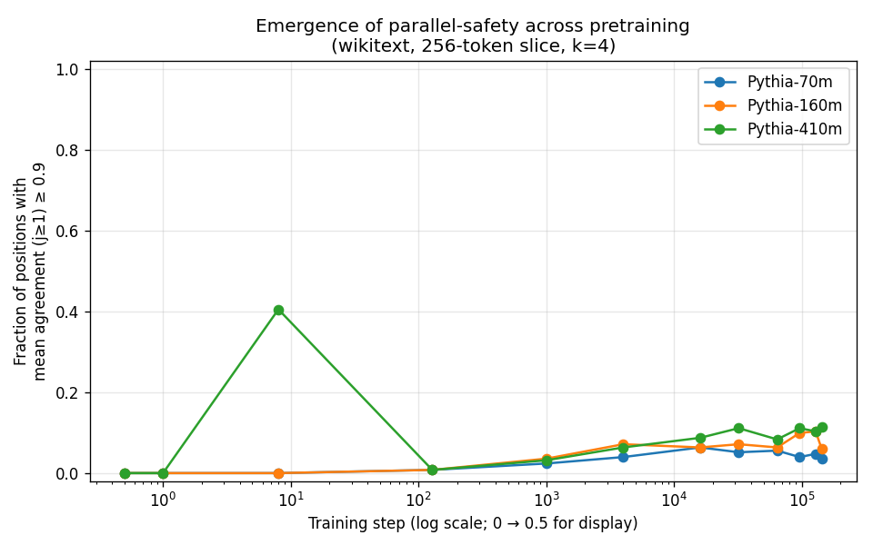

# hybrid-arch

A diagnostic toolkit and an attention-pattern atlas for adaptive LLM inference research.



## What it does

Speculative decoding, mixture-of-depths, and mixture-of-recursions all bet on
the same observation: most tokens an LLM generates are not equally hard. The
hard work in those systems is *deciding which tokens are easy*. This repo
provides:

- A clean, NaN-free per-(layer, head) attention extractor for the GPTNeoX
  family.
- Five per-token metrics (next-token entropy, top-1 probability, per-head
  attention entropy, per-head attention concentration, and an offline
  speculative-decoding-style **parallel agreement** statistic) with batched
  implementations.
- An on-disk cache keyed by `(model_size, training_step, dataset_slice_hash)`
  so a 36-cell sweep across Pythia training checkpoints reruns in milliseconds.
- An empirical study of when in pretraining "parallel-safety" emerges, what
  per-(layer, head) features predict it, and how that signal differs between
  code, math, and prose.

The library is the artifact. The atlas is the proof it does something useful.

## Headline findings (Phase 2, Pythia 70m-410m)

| | |
|---|---|
| **Parallel-safety emerges between training step 128 and step 1000** across all three sizes; the curve barely moves over the next 142,000 steps. | [emergence curve](docs/results/figures/02_emergence_curve.png) |
| **A logistic regression on per-(layer, head) features hits AUROC 0.845 ± 0.083** on Pythia-410m at the final checkpoint. The Phase 1 aggregate result was `\|r\| < 0.11` — the signal is real but the aggregation kills it. | [signature analysis](docs/results/figures/03_signature_auroc.png) |
| **Code is 3.9× more parallel-safe than prose.** On Pythia-410m: WikiText psf = 0.115, GSM8K = 0.194, MBPP = **0.452**. | [domain shift](docs/results/figures/06_domain_shift_heatmap.png) |

Full atlas: [`docs/results/02_emergence_atlas.md`](docs/results/02_emergence_atlas.md).

## Install

```bash
git clone https://github.com/momagzoub/hybrid-architecture.git
cd hybrid-architecture
pip install -e ".[dev]"
pytest -q              # 81 tests, ~30s on CPU
```

Requires Python 3.10+. CPU-only is fine; a T4 helps for the 410m sweep.

## Five-line quickstart

```python
import torch
from hybrid_arch import load_pythia, metric_battery

model, tok = load_pythia("160m", step=143000)
ids = tok("The quick brown fox jumps over the", return_tensors="pt").input_ids
out = metric_battery("160m", 143000, "demo", ids, k_parallel=4, model=model)
# `out` is a dict of per-token tensors, also cached to disk for free re-reads.
print("parallel-safety rate:", out["parallel_agreement"][..., 1:].float().mean().item())
```

## Reproducing the atlas

```bash
python src/scripts/phase2_emergence_curve.py       # ~1 hr from scratch, ms from cache
python src/scripts/phase2_signature_analysis.py    # ~10s
python src/scripts/phase2_token_types.py           # ~2s
python src/scripts/phase2_domain_shift.py          # ~5 min from scratch
```

Every plot and CSV in `docs/results/` is regenerable from these four scripts and
the cached metric batteries in `data/cache/`.

## Repo layout

```
src/hybrid_arch/      importable library — extract_attention, metric_battery,
                      load_pythia, metrics, viz primitives
src/scripts/          phase2_*.py sweep runners, all idempotent over the cache
docs/results/         the atlas + CSV/JSON deliverables + publication figures
tests/                pytest — covers metric correctness, cache hit/miss, NaN-
                      free attention, per-head ↔ aggregate equivalence
```

## Relation to prior work

Upstream of, not competitive with:

- [EAGLE-3](https://arxiv.org/html/2503.01840v1) — speculative decoding with
  0.75-0.85 acceptance, 3-6× speedup.
- [Mixture-of-Recursions](https://arxiv.org/abs/2507.10524) — per-token
  adaptive recursive depth.
- [Mixture-of-Depths](https://arxiv.org/pdf/2404.02258) — per-token layer skipping.

Those systems all consume some signal about per-token difficulty. This repo
characterizes one such signal (parallel agreement), shows it emerges early in
pretraining, finds the per-(layer, head) features that predict it, and ships a
cached pipeline anyone can run on Pythia checkpoints in minutes.

## Status

Phase 2 complete (2026-05-25). Phase 3 next — see
[`PHASE_3_HANDOFF.md`](PHASE_3_HANDOFF.md). Roadmap in
[`PROJECT_PLAN.md`](PROJECT_PLAN.md).

## License

MIT. Author: [Mohamed Magzoub](mailto:m0hamed@mit.edu) · [github.com/momagzoub](https://github.com/momagzoub).
