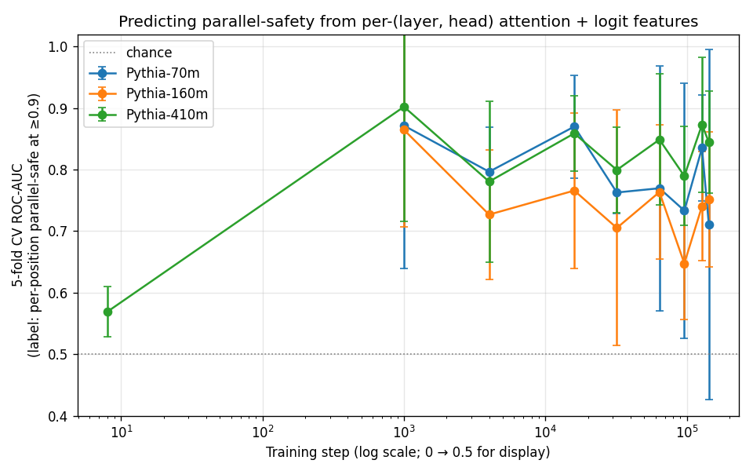
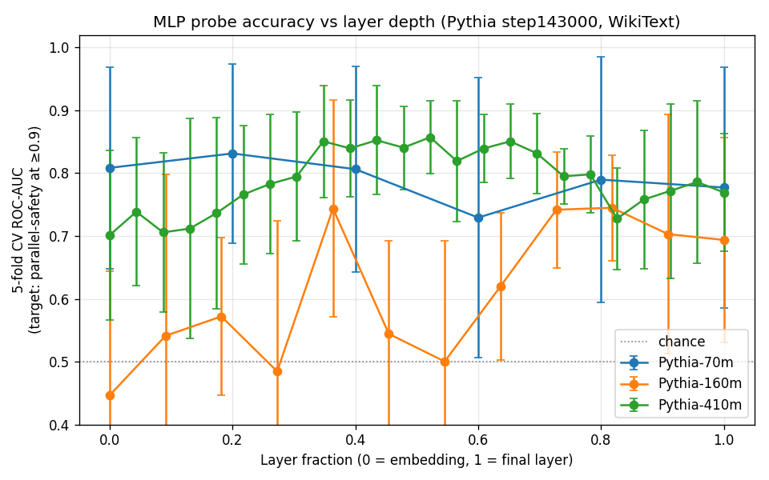
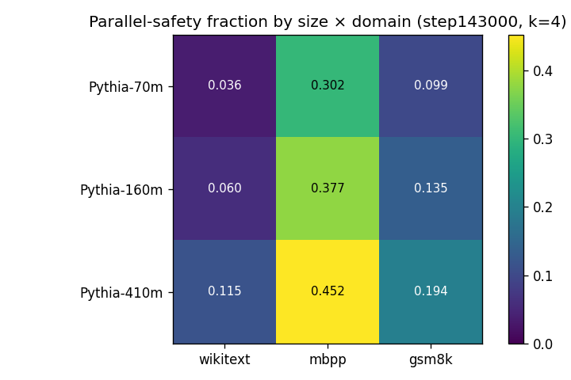
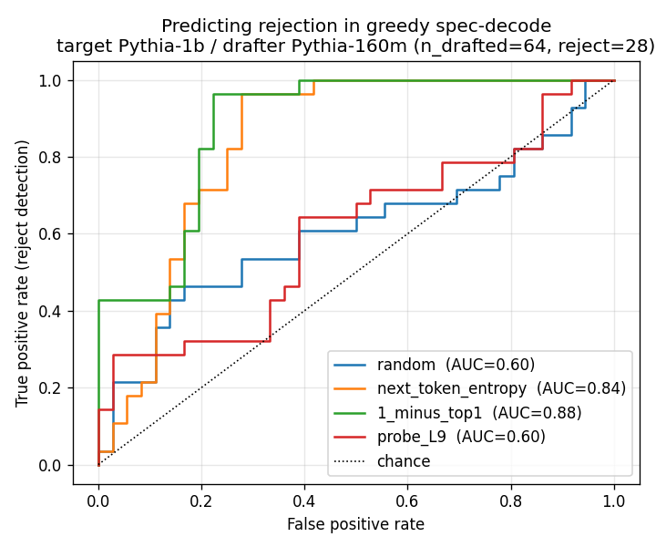

# Parallelism Emerges: charting when a language model learns which tokens are easy

*A study of "parallel-safety" across Pythia's training checkpoints — when it
appears, what attention signature predicts it, and whether that signature is
any use to a real speculative decoder.*

Mohamed Magzoub · 2026 · [github.com/momagzoub/hybrid-architecture](https://github.com/momagzoub/hybrid-architecture)

---

## The question

Modern LLM inference is sequential — one token at a time — even though
training is fully parallel. The economic weight of deployed AI sits almost
entirely on that sequential decode loop, and the techniques that make it
cheaper (speculative decoding, Medusa, EAGLE, mixture-of-recursions) all rest
on a single observation: **not every token needs the full sequential
treatment.** Most of what a model generates is "easy" — predictable enough
that a cheaper computation would have produced the same token.

That raises a question nobody has the data to answer at scale, because the
big labs only release final checkpoints: *when, during pretraining, does a
model learn to make tokens easy — and what does "easy" look like inside the
network?*

EleutherAI's Pythia suite is the rare exception — 154 training checkpoints
per model, across sizes. That makes the developmental question tractable. I
worked with three sizes (70M, 160M, 410M) at twelve log-spaced checkpoints
each, plus Pythia-1B as a verifier, all on free-Colab-class compute.

## Defining "easy" without hand-waving: parallel-safety

I needed a label-free, offline proxy for "this token didn't need sequential
computation." The one I used I call **parallel-safety**:

> For each position, compare the model's next-`k` predictions made in a single
> teacher-forced pass (the model sees the ground-truth prefix) against `k`
> genuine autoregressive steps (the model sees only its own output). A
> position is *parallel-safe* if those two paths agree on at least 90% of the
> `k` lookahead steps.

This is the offline cousin of speculative-decoding acceptance: it's exactly
the event where guessing several tokens at once would have been safe. It needs
no second model and no labels — just one model and a text slice.

One caveat I had to respect throughout: **agreement is not quality.** An
undertrained model that emits the same token everywhere trivially agrees with
itself. Pythia-410M at training step 8 shows precisely this pathology
(parallel-safety 0.40, but every other diagnostic flags it as degenerate), and
I exclude it from interpretation.

## Finding 1 — Parallel-safety emerges early and abruptly


Plotting the fraction of parallel-safe tokens against training step, the
picture is sharp: the capacity appears **between training steps 128 and
1000**, across all three model sizes, and then barely moves over the
remaining 142,000 steps. There's a modest but real size effect at
convergence — 410M reaches ~0.115 on WikiText vs 70M's ~0.05 — but the
*timing* of emergence is essentially size-independent.

This window coincides with where attention sinks are reported to emerge and
where tokenwise loss drops most steeply, which suggests parallel-safety is
one face of a broader early-training phase transition rather than a separate
phenomenon. The practical upshot for anyone studying small-model
spec-decoding: don't use checkpoints below step 1000 — the model isn't yet
doing the thing your metric is trying to measure.

## Finding 2 — The signature is per-head, and the aggregate hides it

The first instinct is to ask: does attention *look* different at parallel-safe
positions? Averaged across all layers and heads, the answer is a flat **no** —
mean attention entropy and concentration correlate with parallel-safety at
|r| < 0.11. That null is real, and it's a trap.

Treating each `(layer, head)` pair as its own feature and fitting a simple
logistic regression tells a completely different story:



| Model | Features | Test AUROC @ final checkpoint |
|-------|---------:|------------------------------:|
| 70M   |      194 | 0.71 |
| 160M  |      578 | 0.75 |
| 410M  |    1,538 | **0.85** |

The signal was always there; averaging across heads washed it out. A handful
of specific heads carry most of the predictive power, and they're dominated by
attention *concentration* with negative weights — **less-concentrated
attention at particular heads predicts parallel-safety**, the opposite of the
naive "attention sink ⇒ easy token" intuition.

When you train a tiny MLP probe (≈50k parameters) on a single layer's hidden
state and sweep the layer, the predictive signal peaks in the **middle** of
the network, not the final layer:



On Pythia-410M, the layer-12-of-24 probe hits AUROC 0.857 — edging out the
full attention regression and beating the final-layer probe by ~0.09. The
final layer has already specialized toward the output distribution; the
structural "is this easy" information lives mid-stack.

## Finding 3 — Code is far more parallel-safe than prose

Re-running the battery on three domains at the final checkpoint:



On Pythia-410M the parallel-safe fraction is 0.115 on WikiText, 0.194 on
GSM8K (math), and **0.452 on MBPP (code)** — a 3.9× gap between code and
prose. Code's syntactic regularity (`def`, `return`, indentation, common
identifiers) makes huge stretches of it predictable; a 70M model on code is
about as parallel-safe as a 410M model on prose. If you benchmark a
speculative decoder on a workload mixing code and text, the mix will dominate
your speedup number more than the model will.

## Finding 4 — The honest null: the probe doesn't beat the obvious baseline

Here's where the project earns its credibility. Having found a clean offline
signature, the obvious next move is to use it as a *router* in real
speculative decoding — flag the tokens a verifier will accept and skip the
expensive check. So I ran greedy speculative decoding with Pythia-1B as the
target and Pythia-160M as the drafter, and asked: what predicts the real
accept/reject events?



The offline probe predicts rejection at AUROC **0.60 — essentially chance.**
The drafter's own `1 − top1` confidence predicts it at **0.88**, with no
training at all.

I then gave the probe every advantage: a 1024-position run, and a logistic
regression *fitted directly on the real rejection labels*. It still didn't
help — `1 − top1` alone scores 0.985, adding the probe moves it by less than
the noise floor, and the probe fitted *alone* tops out at 0.686. The
conclusion is clean and a little humbling: **when you're already running the
drafter, its own logit confidence is the routing signal you want. A learned
probe on hidden states adds nothing on top of it.**

This is not a failure of the analysis — it's the most useful thing the
project says to a practitioner. Parallel-safety is a real, emergent,
attention-linked property worth understanding; but the cheapest possible
signal is already the right router for the obvious application, and a fancier
one isn't worth its complexity.

## The hybrid decoder demo

The final artifact ties it together: a hybrid decoder that routes each
position through a cheap path or the verifier based on the drafter's
confidence. At a conservative threshold it commits **27% of WikiText / 47% of
MBPP / 72% of GSM8K** tokens without the verifier, with a false-keep rate of
≤ 3.3% — the routing fraction tracks domain predictability exactly as the
emergence and domain-shift findings predict. (On throughput: greedy
spec-decode only wins in committed-tokens/sec when acceptance is high, and on
CPU the eager-mode overhead dominates — the demo shows the routing behavior
is correct, not that a 160M/1B pair on a laptop is fast.)

## What I'd build next

- **Cross-model head alignment.** Do the predictive `(layer, head)` pairs sit
  at the same depth fraction across 70M / 160M / 410M? If the signature is
  geometrically stable, it becomes a transferable diagnostic rather than a
  per-model curiosity.
- **A `k=1` token-type re-analysis.** Content words came out *more*
  parallel-safe than function words at `k=4`, which is counterintuitive and
  probably an artifact of the multi-step horizon. A single-step version would
  test that directly.
- **Tree-structured drafting + a purpose-trained drafter.** The honest
  null used an off-the-shelf 160M drafter and a linear chain of guesses.
  EAGLE-style gains come from a trained draft head and a *tree* of candidate
  continuations; whether the attention signature matters in that regime is
  genuinely open.
- **Sampling-based acceptance.** Everything here is greedy. The real
  spec-decode acceptance criterion is a softer, sampling-based event; the
  strict greedy version is the hardest case and the easiest to reason about,
  but not the deployed one.

## Reproducing everything

Every number and figure above regenerates from four scripts and a cached
metric battery:

```bash
pip install -e ".[dev]" && pytest -q          # 107 tests
python src/scripts/phase2_emergence_curve.py
python src/scripts/phase2_signature_analysis.py
python src/scripts/phase3_layer_depth_sweep.py
python src/scripts/phase4_hybrid_bench.py
```

The repo ships the diagnostic library, 42 pretrained probes, four result
atlases, and a lab notebook of every bug that cost real time. The point was
never to beat EAGLE on a laptop — it was to ask a clean developmental
question carefully, answer it reproducibly, and be honest about where the
signal does and doesn't pay off.
