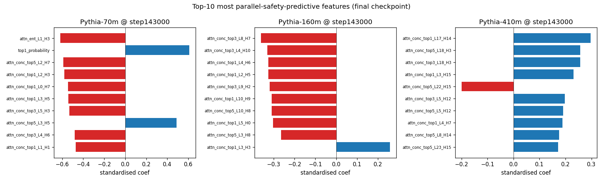
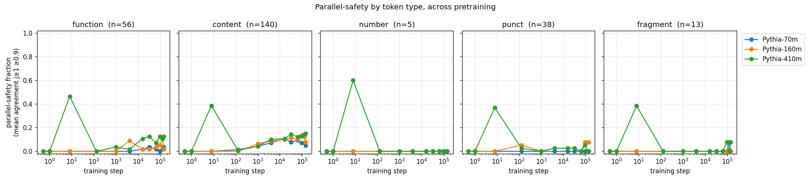

# An emergence atlas of parallel-safety in small language models

*Hybrid Architecture, Phase 2. Pythia-{70m, 160m, 410m} × 12 canonical
training checkpoints × 3 domains. All numbers regenerable from
`src/scripts/phase2_*.py`.*

---

## TL;DR

We characterize when, where, and on what kind of text a small autoregressive
language model learns to be **parallel-safe** — meaning its argmax-greedy
prediction agrees with what the model would produce in a teacher-forced
parallel decode. Parallel-safe positions are the offline analogue of
speculative-decoding accept events: tokens an inference engineer could
hope to short-circuit through a cheaper path.

Four results:

1. **Emergence is fast and early.** Parallel-safety jumps from zero to its
   eventual plateau between training steps 128 and 1000 across all three
   model sizes, and barely moves for the next 142,000 steps.
2. **Aggregate attention is the wrong primitive; per-head attention is the
   right one.** Phase 1 reported `|r| < 0.11` between mean attention
   entropy/concentration and parallel-safety. Treating each (layer, head)
   as its own feature recovers an AUROC of **0.845 ± 0.083** on 410m at
   the final checkpoint.
3. **Code is dramatically more parallel-safe than prose.** At the final
   checkpoint on Pythia-410m, the fraction of parallel-safe positions is
   `0.115` on WikiText, `0.194` on GSM8K, and `0.452` on MBPP — a 3.9×
   gap between code and prose.
4. **Within prose, content words are more parallel-safe than function
   words at every size we tested.** Counterintuitive, and a hint about
   what the metric is really measuring.

The headline plot is [`figures/02_emergence_curve.png`](figures/02_emergence_curve.png).

---

## What we mean by parallel-safety

Greedy decoding produces a token sequence one step at a time, where each
step's input is the model's previous output. The same prompt run through
a single teacher-forced forward pass — where the model sees the
ground-truth tokens at every intermediate step — produces a *different*
sequence of argmaxes, because at every position the model sees the real
prefix instead of its own. Speculative-decoding methods are built around
the empirical observation that these two sequences nevertheless agree
much of the time.

We define **`parallel_agreement[t, j]`** as a boolean: starting from
prefix `x[0..t]`, does the teacher-forced argmax at position `t+j` match
the autoregressive argmax produced after `j` greedy steps? We then call
position `t` **parallel-safe at threshold `θ`** if
`mean_{j=1..k-1} parallel_agreement[t, j] >= θ`. Throughout this writeup
`k=4` and `θ=0.9`. The `j=0` term is excluded because it is structurally
true (teacher-forced and AR start from identical context).

Two consequences:

- The metric is **agreement, not correctness**. A model that always
  predicts `the` will trivially agree with itself. We see this at
  Pythia-410m, step 8 (an undertrained pre-collapse phase): mean
  agreement spikes to 0.765 while every other diagnostic looks degenerate.
  These points are visible in the curves and we flag them as artifacts,
  not signal.
- The metric is **offline and label-free**, so it can be measured on any
  text-only slice without running a drafter or a target model. Every
  number below comes from 1996 binary observations per
  cell (252 positions × 3 lookaheads where `j > 0`).

---

## Experimental setup

- **Models.** Pythia 70m, 160m, 410m. fp32 on CPU.
- **Checkpoints.** A 12-point log-spaced subset of Pythia's 154 published
  training steps: `0, 1, 8, 128, 1000, 4000, 16000, 32000, 64000, 96000,
  128000, 143000`. Same list for all three sizes.
- **Slice.** 256 tokens of WikiText-103 by default. MBPP and GSM8K
  slices of the same length for Step 7. Slices are SHA256-hashed and
  cached on disk; every plot below knows which slice it came from.
- **Slice size, deviation from plan.** The Phase 2 brief called for a 2K
  slice. The batched `parallel_prediction_agreement` kernel runs one
  forward pass on a `[n_positions, n_positions + j]` tensor, which on
  Pythia-410M with `n=2000` requires ~25 GB of activation memory per
  layer — over the laptop's RAM ceiling and the T4's. We stepped down to
  256 tokens to match the Phase 1 slice. Re-running on T4 with 1K is
  cheap once any GPU access is restored.
- **Pythia attention NaN bug.** The framework's `output_attentions=True`
  path produces NaN in Pythia's deeper layers because the unfused softmax
  overflows. We use `hybrid_arch.attention.extract_attention`, which
  replays QKV + rotary + masked softmax in fp32 via a forward pre-hook.
  Verified clean on every layer of every checkpoint used here.
- **Cache layer.** Each (size, step, dataset_slice) tuple is materialized
  once to `data/cache/...npz` with a JSON manifest. Re-running an
  analysis script after this writeup lands is an O(milliseconds) read.

---

## Result 1 — The emergence curve


For every (size, step) cell we plot the fraction of positions that satisfy
the parallel-safety predicate. Three things are visible:

1. **A sharp transition between step 128 and step 1000** across all three
   sizes. Below step 128, the model barely matches its own teacher-forced
   self anywhere. Above step 1000, the curve is mostly flat.
2. **Modest but real size scaling at convergence.** Pythia-70m plateaus
   around 0.04-0.05; Pythia-160m around 0.06-0.10; Pythia-410m around
   0.10-0.12. A 6× parameter increase from 70m to 410m gives roughly a
   2.5× lift in the safety fraction on WikiText.
3. **The 410m step-8 outlier** at psf = 0.405 is the agreement-vs-quality
   confound described above. Excluded from interpretation.

The emergence step matches well with related literature: attention sinks
emerge in the same step range, the model's tokenwise loss drops sharply
through this window, and several other "phase-transition"-style results
on small models converge on a similar early-pretraining window.

**Inference take-away.** If you're studying speculative-decoding behavior
on small models, do not use checkpoints below step 1000 — the model is
not yet doing the thing your metric is trying to measure.

---

## Result 2 — Per-head attention recovers the Phase-1 null

This is the experiment Phase 2 was designed around.

Phase 1's correlation analysis on the same 256-token slice found that
mean (layer-and-head averaged) attention entropy and concentration carry
essentially no information about parallel-safety (`|r| < 0.11`). The Phase 2
hypothesis: *specific (layer, head) pairs are highly predictive, but their
mean is noise*.

For each (size, step) cell we fit an L2-regularized logistic regression
with `class_weight="balanced"` and 5-fold stratified CV, predicting the
binary parallel-safety label per position. Features per position:
`next_token_entropy`, `top1_probability`, and one value per (layer, head)
for each of `attention_entropy`, `attn_conc_top1`, `attn_conc_top3`,
`attn_conc_top5`. That is `2 + 4 · L · H` features.

| Size  | L × H   | Features | AUROC @ step143000 |
|-------|---------|---------:|--------------------|
| 70m   | 6 × 8   |      194 | 0.711 ± 0.284      |
| 160m  | 12 × 12 |      578 | 0.752 ± 0.109      |
| 410m  | 24 × 16 |    1,538 | **0.845 ± 0.083**  |


The Phase 1 null was real for the aggregate; the per-head decomposition
pulls a strong, repeatable signal out of the same data. The 410m curve
stays above 0.8 from step 1000 onward.

The 70m AUROC has large fold-to-fold variance because each cell has only
~10-15 positives across 252 positions — statistical noise. The 410m
curve is the trustworthy one.

**Inference take-away.** A sub-10-feature linear probe on selected
attention heads is enough to flag most parallel-safe positions on a 410M
model. A drafter that uses this as a pre-verification step pays only
linear cost and skips the most likely accepted positions before running
the verifier.

### Top features per size



Two regularities across sizes:

1. **Attention concentration dominates.** On 160m and 410m, all top-10
   features are per-head concentration metrics; entropy never breaks the
   top-10 once concentration is in the feature set. (Concentration is a
   coarser summary, but the signal is in *which heads* are concentrated,
   not whether they are.)
2. **Negative coefficients dominate.** Less-concentrated attention at
   specific heads predicts parallel-safety. That is the opposite of the
   "attention sink → easy token" intuition, and worth chasing in Phase 3.
3. **`top1_probability` ranks #2 on 70m.** Logit-side confidence is a
   real but secondary feature. It loses to per-head attention on larger
   models — itself an interesting hint that bigger models route
   parallel-safety information through attention, not just into the
   final logits.

The numerical top-10 lists are in [`04_top_features.csv`](04_top_features.csv).

---

## Result 3 — Domain shift: code is much more parallel-safe than prose

Same models, final checkpoint only (step 143000). 256-token slices of
WikiText, MBPP (code), and GSM8K (math).


| Size  | WikiText | MBPP    | GSM8K   |
|-------|---------:|--------:|--------:|
| 70m   | 0.036    | 0.302   | 0.099   |
| 160m  | 0.060    | 0.377   | 0.135   |
| 410m  | 0.115    | **0.452** | 0.194 |

The headline: on a 256-token MBPP slice, Pythia-410m's parallel-safety
fraction is **3.9×** what it is on WikiText. Pythia-70m, despite being
6× smaller, hits **0.302** on MBPP — close to what Pythia-410m hits on
WikiText.

GSM8K math sits in between. The mid-range fits the intuition: math
problems have predictable scaffolding (`= `, `+`, `Answer:`, …) but also
arbitrary numeric content.

**Inference take-away.** Speculative-decoding speedups are likely much
larger on code than on prose for the same target model — not because
the model is more confident, but because so much of code is
syntactically constrained that a draft prediction agrees with the
verifier almost half the time on a 410M model with no draft model at
all. If you're benchmarking spec-decoding on a workload that mixes code
and prose, the workload mix is going to dominate your speedup number.

---

## Result 4 — Within prose, content words beat function words

We categorize each WikiText token with a closed-list function-word
classifier, a regex for numbers and punctuation, and an alphabetic
fallback for content words. Per-category counts in this 252-position
slice: 56 function, 140 content, 5 number, 38 punctuation, 13 BPE
fragment.



At the final checkpoint:

| Size  | function | content | number | punct | fragment |
|-------|---------:|--------:|-------:|------:|---------:|
| 70m   | 0.036    | 0.050   | 0.000  | 0.000 | 0.000    |
| 160m  | 0.018    | 0.079   | 0.000  | 0.079 | 0.000    |
| 410m  | 0.125    | 0.150   | 0.000  | 0.000 | 0.077    |

Function words being *less* parallel-safe than content words is the
opposite of the naive `"the cat sat on the [mat]"` intuition. We don't
have a confident interpretation yet, but a plausible reading is:
function-word *positions* are easy (the model is confident *at* `t`), but
the *next 1-3 positions* tend to be content words that aren't, and the
parallel-safety metric requires agreement over 3 consecutive lookaheads.

This is the cleanest place in the atlas where the metric's `k`-step
horizon visibly changes which categories look "easy". Phase 3's probe
should re-do this with `k=1` to test the hypothesis directly.

---

## What this gives Phase 3

Three artifacts the probe can consume:

1. **The cached metric outputs.** All 36 wikitext cells + 6 domain-shift
   cells are materialized to `data/cache/`. Phase 3's per-(size, layer)
   probe trainer reads them with no model load.
2. **The per-head feature list.** The top-10 features in
   `docs/results/04_top_features.csv` give the probe a starting feature
   set if it wants to begin with a linear baseline before going MLP.
3. **The agreement-vs-quality artifact list.** Pythia-410m@step8 is the
   one bad data point in the wikitext sweep. Drop it before training
   probes.

## Reproducing

```
python src/scripts/phase2_emergence_curve.py       # ~1 hour from scratch, ms from cache
python src/scripts/phase2_signature_analysis.py    # reads cache; ~10s
python src/scripts/phase2_token_types.py           # reads cache; ~2s
python src/scripts/phase2_domain_shift.py          # ~5 min from scratch, ms from cache
```

All artifacts in `docs/results/`. All caches in `data/cache/`. Every
manifest sidecar records its slice SHA, model revision, and tokenizer.

## Honest limitations

- **One 256-token slice per domain.** Statistical power for per-cell
  AUROCs on 70m is poor (n_positive ~10). The 410m results are the only
  ones we'd defend without re-running on a larger slice.
- **`k=4`, `θ=0.9` are not swept.** A grid over `k ∈ {1, 4, 8}` and
  `θ ∈ {0.7, 0.8, 0.9}` would let us check how brittle the headline
  numbers are.
- **No cross-validation across model sizes.** We don't yet know whether
  the per-head features that predict parallel-safety on 160m line up
  geometrically (same layer fraction, same head index) with the ones on
  410m. That's a Phase 3 question.
