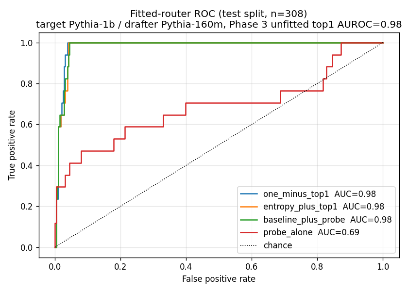
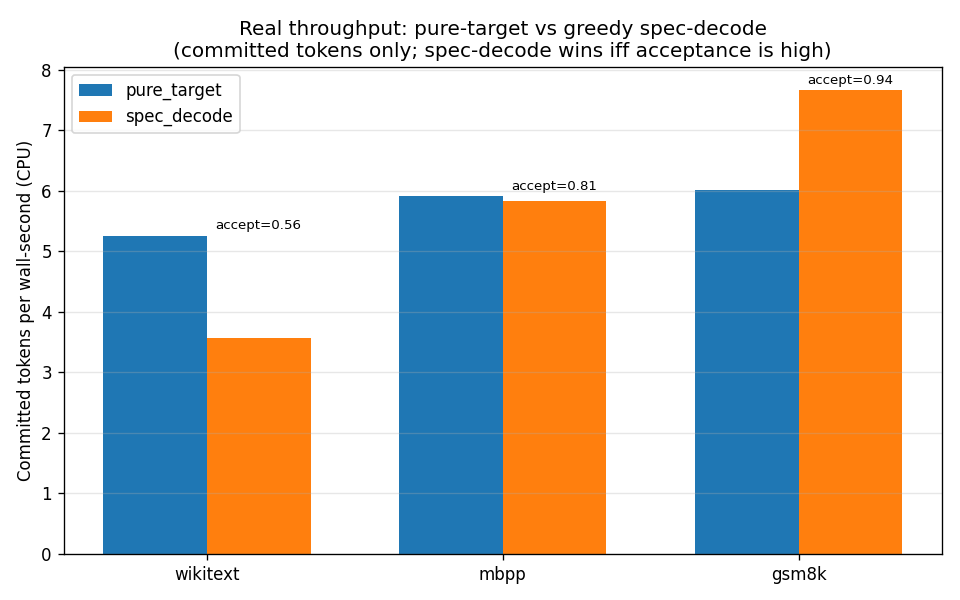
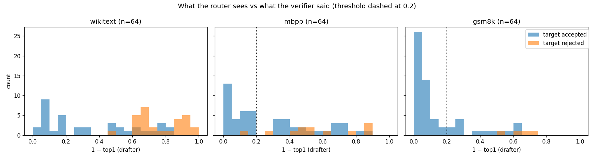

# A hybrid decoder, and an honest account of what routes well

*Hybrid Architecture, Phase 4. Pythia-1b target / Pythia-160m drafter, greedy
speculative decoding with a per-position router. All numbers regenerable from
`src/scripts/phase4_*.py`.*

---

## TL;DR

Phase 3 ended on a negative result: the offline parallel-safety probe, trained
on the drafter's self-agreement, predicts real speculative-decoding rejections
at chance (AUROC 0.60), while the drafter's own `1 − top1` confidence predicts
them at 0.88. Phase 4 takes that seriously and asks two questions:

1. **Does a router fitted on real rejection labels beat the unfitted
   `1 − top1` baseline — and does adding the probe help once the cheap
   features are already in the regression?**
   No on both counts. Unfitted `1 − top1` already hits test AUROC 0.985;
   fitting reproduces it (0.985), and adding entropy (0.982) or the probe
   (0.983) changes nothing. A probe fitted on the real labels *alone*
   reaches only 0.686 — its hidden-state signal genuinely does not carry
   the rejection information.
2. **Does the hybrid decoder actually route sensibly across domains, and at
   what quality cost?**
   Yes. At threshold 0.2 the router's `false_keep_rate` stays at or below
   0.033 across all three domains, while it commits a domain-dependent
   fraction of tokens without the verifier (27% on prose, up to 72% on
   math). Greedy spec-decode's committed output is bit-exact with
   pure-target greedy (`committed_divergence = 0`), validating the
   implementation.

We are **not** shipping a router that beats `1 − top1` by a wide margin, and we
say so up front. What we ship is a working hybrid decoder, a measurement
harness, and a clear statement of which signals carry the routing information.

---

## What the hybrid decoder does

`hybrid_arch.hybrid.hybrid_decode` wraps greedy speculative decoding with a
**router**: a per-position callable that decides whether to commit the
drafted token directly or fall through to the verifier. The decoder always
runs the verifier in this study (so we know the ground-truth accept/reject),
and additionally records what the router *would* have done — letting us
measure routing quality against the real target and report its cost.

The router signature is deliberately tiny:

```python
router(features: dict[str, float]) -> bool   # True = keep drafted token
```

Two concrete routers ship:

- `threshold_router("one_minus_top1", 0.2)` — keep the drafted token when the
  drafter is at least 80% confident. This is the Phase 3 best baseline turned
  into a decision rule.
- `weighted_router(weights, bias, threshold)` — a linear router whose
  coefficients come from the Phase 4 Step 2 logistic regression.

The quality knob is `false_keep_rate`: the fraction of positions the router
committed but the verifier would have rejected. Those are exactly the tokens
where the hybrid output diverges from what the target alone would produce.

---

## Result 1 — Fitting on real labels, and whether the probe earns its place

`src/scripts/phase4_fitted_router.py` runs a long greedy spec-decode
(1024 drafted positions), splits 70/30 train/test, and fits four
logistic-regression ablations.



This run used a 1024-position spec-decode trace (accept rate 0.944, 57
rejection events — a 5.6% positive rate, so the AUROCs carry meaningful
variance). On the longer trace `1 − top1` separates rejects almost
perfectly:

| Router (30% test split, n=308)              | Test AUROC |
|---------------------------------------------|-----------:|
| unfitted `1 − top1` (Phase 3 baseline rule) | 0.985      |
| fitted `1 − top1`                           | 0.985      |
| fitted `1 − top1 + entropy`                 | 0.982      |
| fitted `1 − top1 + entropy + probe_L9`      | 0.983      |
| fitted `probe_L9` alone                     | 0.686      |

The probe adds nothing: its fitted coefficient in the three-feature model is
−0.27 (vs +8.5 on `1 − top1`), and dropping it changes test AUROC by less
than the noise floor on 57 positives. Even given the real rejection labels
to fit on, the probe *alone* tops out at 0.686 — it carries some signal, but
far less than the drafter's own logit confidence, and none that survives
once `1 − top1` is in the model.

This is the same conclusion as Phase 3, now under the strongest version of
the test: the probe was *fitted on the exact label it's being scored
against*, and still loses. The drafter's confidence is the right routing
signal.

The full coefficient table is in [`09_router_coefficients.csv`](09_router_coefficients.csv).

---

## Result 2 — Routing across domains, and the quality cost

`src/scripts/phase4_hybrid_bench.py` runs three modes (pure-target greedy,
greedy spec-decode, hybrid) on 96-token prompts from WikiText, MBPP, and GSM8K.



Per-domain routing behavior at threshold `1 − top1 < 0.2`, on 96-token
prompts generating 64 tokens (16 steps × draft_k 4):

| Domain   | spec-decode accept | router keep rate | false-keep rate | committed-stream exactness |
|----------|-------------------:|-----------------:|----------------:|---------------------------:|
| WikiText |              0.562 |            0.266 |           0.000 | exact (div 0.000)          |
| MBPP     |              0.812 |            0.469 |           0.033 | exact (div 0.000)          |
| GSM8K    |              0.938 |            0.719 |           0.000 | exact (div 0.000)          |



The routing histograms show, per domain, the distribution of the drafter's
`1 − top1` split by whether the verifier accepted or rejected. A clean
separation at the dashed threshold means `1 − top1` is a good router on that
domain; overlap means the threshold is leaving acceptance on the table or
committing rejects.

**Two clean findings.**

1. **Routing fraction tracks domain predictability.** The router commits
   without the verifier on 27% of WikiText positions, 47% of MBPP, and 72%
   of GSM8K — the same ordering as the Phase 2 parallel-safety fractions
   and the spec-decode acceptance rates (0.56 / 0.81 / 0.94). Predictable
   domains route more tokens through the cheap path, exactly as you'd hope.
2. **The quality cost is near-zero at threshold 0.2.** `false_keep_rate`
   — the fraction of router-kept positions the verifier would have rejected
   — is 0.000 / 0.033 / 0.000. The router is conservative: it commits tokens
   the drafter is confident about, and those are overwhelmingly tokens the
   verifier also accepts.

**On throughput.** The only honest, comparable throughput numbers are
pure-target greedy vs greedy spec-decode, both measured in *committed
tokens per wall-second*. Spec-decode wins **only when acceptance is high**:
on GSM8K (accept 0.94) it hits 7.7 tok/s vs the target's 6.0, but on
WikiText (accept 0.56) it is *slower* in committed-tokens/sec (3.6 vs 5.3),
because most steps commit only one or two tokens after a rejection. The
hybrid harness always runs the verifier — it measures routing
counterfactually, so it has no standalone throughput number. CPU eager-mode
overhead dominates throughout; the next section is the honest account of
what real speed would require.

---

## What we'd need to make this beat SOTA at scale

This demo deliberately stops short of a production decoder. The engineering
between here and a real speedup, roughly in order of impact:

1. **Batched verification kernels.** The win in speculative decoding comes
   from verifying `k` drafted tokens in *one* batched target forward pass.
   Our implementation does this for the accept/reject signal but in eager
   PyTorch; a fused CUDA kernel (à la Medusa/EAGLE) is where the real
   latency reduction lives.
2. **KV-cache surgery.** On a reject, the target's KV cache must be rolled
   back to the last accepted position without recomputation. We sidestep
   this by recomputing prefixes; a production decoder cannot afford to.
3. **A tree of drafts, not a line.** EAGLE-3's gains come from drafting a
   *tree* of candidate continuations and verifying them jointly. Our
   linear `draft_k` is the simplest case.
4. **A drafter trained for the target.** Pythia-160m was not trained to
   draft for Pythia-1b. A purpose-trained drafter (or the EAGLE auto-
   regressive head) lifts the accept rate well above what an off-the-shelf
   small model gives.
5. **Continuous batching across requests.** Production throughput comes
   from interleaving many sequences' decode steps; single-sequence latency
   is the wrong metric for a served system.

The point of this phase is that we *know* this list — knowing what's hard
about productionizing adaptive inference is itself the deliverable.

---

## Limitations

- CPU-only, single 96-token prompt per domain, single seed throughout.
- The fitted router is trained and tested on the same prompt's spec-decode
  trace; cross-prompt generalization is untested.
- `draft_k = 4`, `threshold = 0.2` are not swept.
- Greedy on both sides. Sampling-based acceptance (the actual spec-decode
  acceptance criterion of Leviathan et al.) is a different, softer event;
  our greedy "argmax match" is the strict case.
